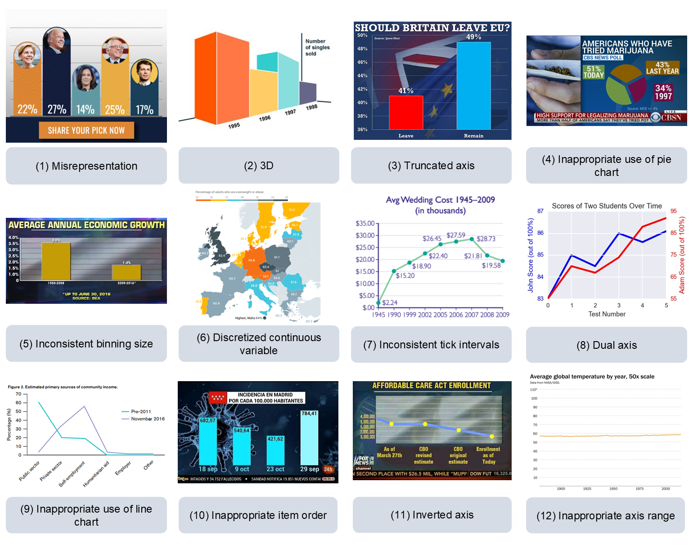
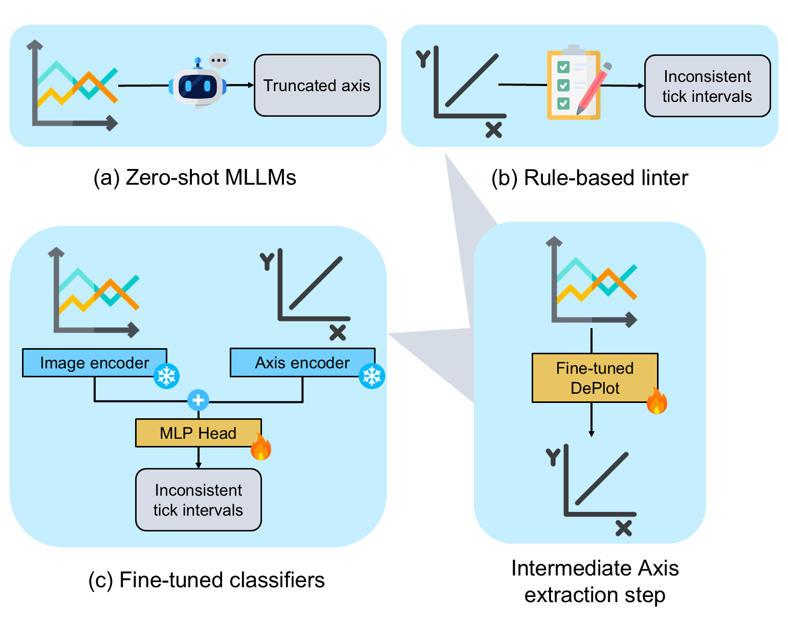

# Is this chart lying to me? Automating the detection of misleading visualizations

[](https://opensource.org/licenses/Apache-2.0)
[](https://www.python.org/)

This repository contains the datasets and code associated with the arXiv preprint: [Is this chart lying to me? Automating the detection of misleading visualizations](https://arxiv.org/abs/2502.20503). The Misviz and Misviz-synth datasets are released under a **CC-BY-SA 4.0** license. The code is released under an **Apache 2.0** license.

Contact person: [Jonathan Tonglet](mailto:jonathan.tonglet@tu-darmstadt.de) 

[UKP Lab](https://www.ukp.tu-darmstadt.de/) | [TU Darmstadt](https://www.tu-darmstadt.de/)

Don't hesitate to send us an e-mail or report an issue, if something is broken (and it shouldn't be) or if you have further questions. 

<p align="center">
  
</p>

## Abstract 

> Misleading visualizations are a potent driver of misinformation on social media and the web. By violating chart design principles, they distort data and lead readers to draw inaccurate conclusions.  Prior work has shown that both humans and multimodal large language models (MLLMs) are frequently deceived by such visualizations. Automatically detecting misleading visualizations and identifying the specific design rules they violate could help protect readers and reduce the spread of misinformation. However, the training and evaluation of AI models has been limited by the absence of large, diverse, and openly available datasets.
In this work, we introduce Misviz, a benchmark of 2,604 real-world visualizations annotated with 12 types of misleaders. To support model training, we also release Misviz-synth, a synthetic dataset of 81,814 visualizations generated using Matplotlib and based on real-world data tables. We perform a comprehensive evaluation on both datasets using state-of-the-art MLLMs, rule-based systems, and fine-tuned classifiers. Our results reveal that the task remains highly challenging.


## tl;dr 

😯 Misleading visualizations are a dangerous form of misinformation. We need to develop methods to detect design issues in charts that make them misleading
📊 We introduce two datasets for the task of misleading visualization detection
  - Misviz-synth: a large dataset of synthetic matplotlib charts based on real-world data tables
  - Misviz: a small benchmark dataset of real-world charts collected from the web
  - Instructions to load the datasetes are provided in [Datasets](#datasets)
🤖 We evaluate three type of models on both datasets
  - Zero-shot MLLMs
  - A new rule-based linter that verifies the axis metadata of a visualization
  - Two classifiers fine-tuned on Misviz-synth


<p align="center">
  
</p>


## Environment

Follow these instructions to recreate the environment used for our experiments.

```
$ conda create --name lying_charts python=3.9
$ conda activate lying_charts
$ pip install -r requirements.txt
```

## Datasets

### Misviz-synth

- *data/misviz_synth/misviz_synth.json* contains the task labels and metadata
- The visualizations, the underlying data tables, and the axis metadata can be downloaded from TU-Biblio

### Misviz 

- *data/misviz/misviz.json* contains the task labels and metadata
- The visualizations can be downloaded from the web using the following script

```python
$ python data/download_misviz_images.py --use_wayback 0
```

## Experiments

### Evaluate zero-shot MLLMs

```python
$ python src/mllm_inference/misleader_detection_MLLM.py --datasets misviz_synth-misviz --split test --model internvl3/8B/ --max_tokens 200
```

The ```--model``` argument expects a string in the format ```model_name/model_size/```. By default, the following models are available:

| Name     | Available sizes | 🤗 models   |
| :---: | :---: | :---: |
| internvl3   |  8B, 38B, 78B | [Link](https://huggingface.co/collections/OpenGVLab/internvl3-67f7f690be79c2fe9d74fe9d) |
| qwen2.5-vl      | 7B, 32B, 72B   | [Link](https://huggingface.co/collections/Qwen/qwen25-vl-6795ffac22b334a837c0f9a5)  |

We also provide code to conduct experiments with GPT-4.1, GPT-o3, Gemini-1.5-flash, and Gemini-1.5-pro using the OpenAI API and the Google AI Studio. You will first need to obtain API keys from both providers and store them as environment variables.

### Fine-tune DePlot for axis extraction and predict axis metadata

To apply the linter to Misviz and to train the classifiers, we need to extract axis metadata from visualizations. This is done by fine-tuning DePlot on the  Misviz-synth train set. 
To fine-tune deplot, we provide a shell script ```src/model_tuning/02_deplot_finetune/01_run_accelerate_deplot_finetuning.sh``` which you can adjust to your needs.

```
$ sbatch src/model_tuning/02_deplot_finetune/01_run_accelerate_deplot_finetuning.sh
```
Once the model is fine-tuned, axes can be predicted for all splits of Misviz-synth and Misviz using the following two shell scripts, which you can again adjust to your needs.

```
$ sbatch src/model_tuning/03_deplot_axis_extraction_classifier/01_run_axis_prediction_precomp_split_0.sh
$ sbatch src/model_tuning/03_deplot_axis_extraction_classifier/01_run_axis_prediction_precomp_split_1.sh
```

### Rule-based linter

The rule-based linter can be evaluated both on ground truth and predicted axis metadata for Misviz-synth, but only on predicted axis metadata for Misviz. 

```python
$ python src/rule_based_linter/linter.py --datasets misviz_synth --split test --use_predicted_axis 0
```

### Fine-tuned classifiers

In order to train the classifiers, the embeddings of the visualization images and of the axis metadata can be pre-computed using TinyChart and TAPAS, respectively.

For image embeddings, adjust and run the following shell script:

```
$ sbatch src/model_tuning/01_precomputation/01_run_all_img_precomp.sh
```

For axis metadata embeddings, run the following python script.

```python
$ python src/model_tuning/03_deplot_axis_extraction_classifier/02_encode_tables.py
```

Then, the classifiers can be trained as follows:

```python
$ python src/model_tuning/03_deplot_axis_extraction_classifier/03_run_all_experiments.py
```

## Citation

If you find this work relevant to your research or use this code in your work, please cite our paper as follows:

```bibtex 
@article{tonglet2025misviz,
  title={Is this chart lying to me? Automating the detection of misleading visualizations},
  author={Tonglet, Jonathan and Zimny, Jan and Tuytelaars, Tinne and Gurevych, Iryna},
  journal={arXiv preprint arXiv:XXXX.XXXX},
  year={2025},
  url={https://arxiv.org/abs/XXXX.XXXX},
  doi={10.48550/arXiv.XXXX.XXXX}
}
```


## Disclaimer

> This repository contains experimental software and is published for the sole purpose of giving additional background details on the respective publication.
